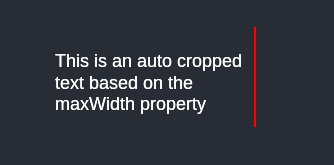

# canvas-drawing

**A bunch of Javascript functions that make canvas drawing easier**
 - 🚀 powered by Rust & WebAssembly, so the browser execute binary under the hood
 - 🌿 access with a fluent API, clean code first !
 - 🎨 Css-like properties names
 - 📖 and TS types included

## Example with React
```javascript
import { arrow, line, arrowHead, LineStyle, ellipse, diamond, text, LineCap } from 'canvas-drawing'
import React, { useEffect, useRef } from 'react'

function App() {
  const canvasRef = useRef<HTMLCanvasElement>(null)

  useEffect(() => {
    const context = canvasRef.current.getContext('2d')
    diamond()
      .x(140).y(0).width(60).height(40)
      .borderColor('yellow').backgroundColor('grey')
      .draw(context)

    ellipse().x(160).y(60).width(60).height(40)
      .borderColor('white')
      .borderStyle(LineStyle.Dashed)
      .draw(context)

    text("Hello").start(10, 90)
      .color('#FFF').fontSize(34)
      .draw(context)

    arrow()
      .body(
        line().from(10, 10).to(120, 100).width(6)
        .color('white').cap(LineCap.Round).quadraticCurve(160, 10)
      )
      .head(
        arrowHead().color('red').width(6).size(16)
      )
      .draw(context)

  }, [])
  return (
    <canvas ref={canvasRef} />
  )

}
```


## text

| Parameter | Type     | Description                       |
| :-------- | :------- | :-------------------------------- |
| `start`    | x: `number`, y: `number` | postion of the start point |
| `value`   | `string` | text content |
| `fontSize`   | `number` |
| `fontFamily`  | `string` |
| `color`  | `string` | A string parsed as [CSS](https://developer.mozilla.org/en-US/docs/Web/CSS/CSS_colors) color or a [CanvasGradient](https://developer.mozilla.org/en-US/docs/Web/API/CanvasGradient) object |
| `borderColor`  | `string` |
| `lineHeight`  | `number` | Ratio based on font-size. Default: 1.2.
| `maxWidth`  | `number` | If given, text will be cropped and multi-lined automatically.
| `lineWeight`  | `LineWeight` | `Normal`, `Light`, `Bold`
| `bold`  |  | Shortup for setting lineWeight to Bold
| `lineStyle`  | `LineStyle` | `Normal`, `Italic`, `Oblique`. Italic vs Oblic : Italic is described in the font declaration. Oblique is a browser text slant.
| `italic`  |  | Shortup for setting lineStyle to Italic
| `underline`  | `bool` | undefined | no args (undefined) is a shortcup for `true`

```javascript
    text("This is an auto cropped text based on the maxWidth property")
      .start(0, 40)
      .color('#FFF')
      .fontSize(18)
      .maxWidth(200)
      .fontFamily("Arial")
      .draw(context)
    line().from(200,0).to(200,100).width(2).color('red').draw(context)
```


## line

| Parameter | Type     | Description                       |
| :-------- | :------- | :-------------------------------- |
| `from`    | x: `number`, y: `number` | postion of the start point |
| `to`      | x: `number`, y: `number` | position of the end point |
| `width`   | `number` | width of the line |
| `style`   | LineStyle | Default: LineStyle.SOLID |
| `cap`  | `LineCap` | Default: LineCap.BUTT |
| `color`  | `string` | A string parsed as [CSS](https://developer.mozilla.org/en-US/docs/Web/CSS/CSS_colors) color or a [CanvasGradient](https://developer.mozilla.org/en-US/docs/Web/API/CanvasGradient) object |
| `quadraticCurve`  | x: `number`, y: `number` | The quadratic curve control point |
| `bezierCurve`  | x1: `number`, y1: `number`, x2: `number`, y2: `number` | The bezier curve control points |

## arrow

| Parameter | Type     
| :-------- | :------- |
| `body`    | Line |
| `head`      | ArrowHead |

## arrowHead

| Parameter | Type     | Description                       |
| :-------- | :------- | :-------------------------------- |
| `width`   | `number` | width of the line |
| `size`   | `number` | arrow head size |
| `color`  | `string` | A string parsed as [CSS](https://developer.mozilla.org/en-US/docs/Web/CSS/CSS_colors) color or a [CanvasGradient](https://developer.mozilla.org/en-US/docs/Web/API/CanvasGradient) object |

## rectangle, ellipse, diamond

| Parameter | Type     | Description                       |
| :-------- | :------- | :-------------------------------- |
| `x`       | `number` | X position of the top left corner |
| `y`       | `number` | Y position of the top left corner |
| `width`   | `number` | Total width of the rectangle, borders included |
| `height`  | `number` | Total height of the rectangle, borders included |
| `opacity`  | `number` | Between 0 and 1. Default: 1 |
| `backgroundColor`  | `string` | A string parsed as [CSS](https://developer.mozilla.org/en-US/docs/Web/CSS/CSS_colors) color or a [CanvasGradient](https://developer.mozilla.org/en-US/docs/Web/API/CanvasGradient) object |
| `borderStyle`  | `LineStyle` | Default: LineStyle.SOLID |
| `borderColor`  | `string` | A string parsed as [CSS](https://developer.mozilla.org/en-US/docs/Web/CSS/CSS_colors) color or a [CanvasGradient](https://developer.mozilla.org/en-US/docs/Web/API/CanvasGradient) object |
| `borderWidth`  | `number` | Default: 4 |


